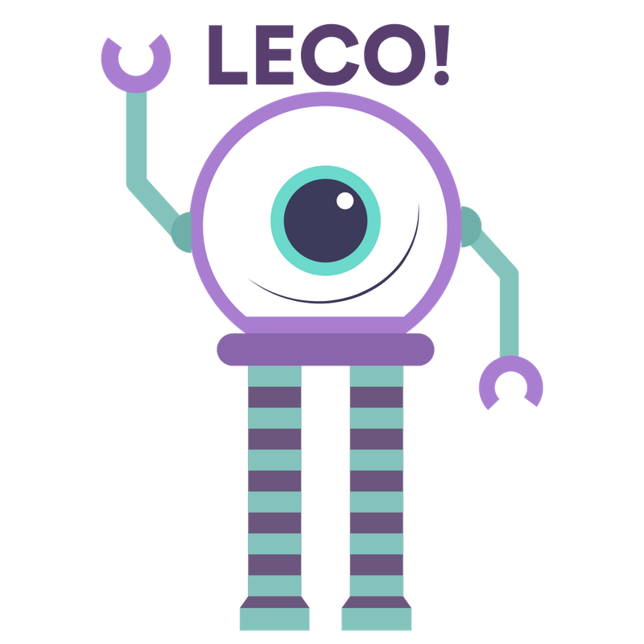

# Leco, o seu contador de histórias
Chatbot para Whatsapp que disponibiliza livros em diversos formatos

# Quem é Leco?
Leco é o nosso chatbot para Whatsapp que vai reacender o interesse de milhões de jovens pela leitura. Nós o desenvolvemos para o desafio da [Árvore Educação](https://arvoreeducacao.com.br/) na [3ª edição do Mega Hack](https://www.megahack.com.br/). 

# Como criamos o Leco?
O Leco funciona a partir de duas APIs e uma aplicação Python com Flask, hospedada no Heroku, que faz a integração dessas APIs.

Primeiro nós temos o [Twilio](https://www.twilio.com/), que é uma plataforma que fornece diversas APIs voltadas para comunicação, desde SMS até videoconferências. No nosso caso, estamos usando a [API para Whatsapp](https://www.twilio.com/whatsapp), que nos fornece um número de telefone e um sandbox para testar nosso bot. Depois nós temos o [Dialogflow](https://cloud.google.com/dialogflow?hl=pt-br), que faz parte do [Google Cloud Platform](https://cloud.google.com/). Com ele podemos desenvolver interfaces de conversação para sites, aplicativos e plataformas de mensagens. Usamos o Dialogflow para desenvolver todo o comportamento do nosso bot. 
